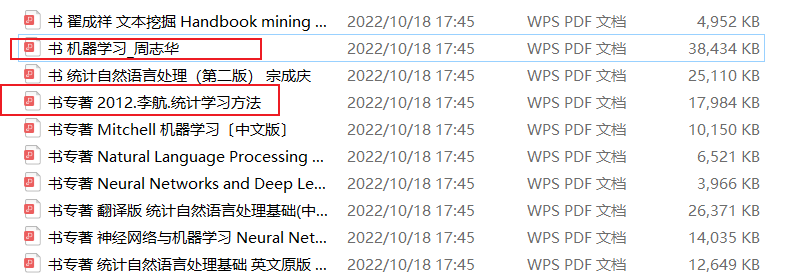

# 一、基本说明

> 导师实验室安排的基础科研学习

## 基本目标

- 学习基础Python脚本式语言
- 掌握基础机器学习、统计方法，提升思维能力
- 进行简单地科研小demo实现
- 了解学习前沿技术，拓展思维、研究
- 为毕设选题做基础（工程+部分算法）

## 基本路线

- 2022.10.23 - 23.01.01 

1. 学习机器学习&统计学习方法为主，结合啃西瓜书视频进行学习
2. 数据挖掘进行辅助学习（2022.11.10左右进行，课程考试）

- 2023.01.01 - 23.03.03

进一步深入学习数据挖掘、NLP

## 时间规划

待10.23进行周结结束后再进行安排
